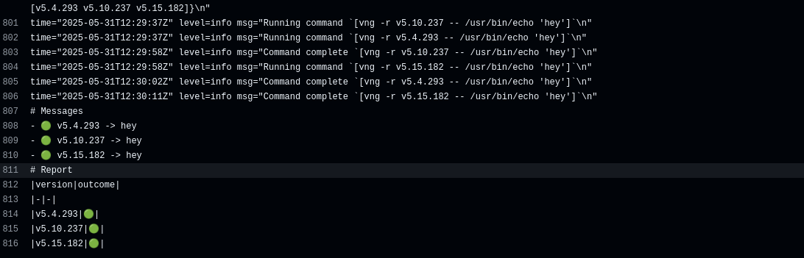

# bpfvalidator

`bpfvalidator` is a simple tool that spawns qemu machines to test a specific binary on these machines. This is particularly useful for testing eBPF programs against different kernel versions.
Under the hood it uses [virtme-ng](https://github.com/arighi/virtme-ng) tool to create qemu instancies.
Given this configuration file:

```yaml
# Path to the virtme-ng binary
vng_path: "vng"
# Command/script to run inside the VM (path + arguments)
cmd: "/usr/bin/echo 'hey'"
# Number of parallel VMs to run
parallel: 1
# Path to the output file for the report (if empty uses stdout)
out_path: ""
# show only the final report and not the individual VM outputs
report_only: false
# kernel versions to test
kernel_versions:
    - v5.4.293
    - v5.10.237
    - v5.15.182
```

`bpfvalidator` will:

- create 3 qemu machines with the kernel versions specified in the configuration file
- run the command `/usr/bin/echo 'hey'` in each of them
- wait for the command to finish
- collect the output of the command
- generate a report telling if the command passed or failed

```bash
./bpfvalidator --config config.yaml
```

By default the output will contain the messages from the VMs and the report in a human-readable format:

```markdown
# Messages
- 🟢 v5.4.293 -> hey
- 🟢 v5.10.237 -> hey
- 🟢 v5.15.182 -> hey

# Report
|version|outcome|
|-|-|
|v5.4.293|🟢|
|v5.10.237|🟢|
|v5.15.182|🟢|
```

it is possible to obtain only the report using the config key `report_only` or the corresponding command line flag `--report-only`.

> __Note__: each configuration key can be overridden by command line arguments with the same name, so you can use the configuration file as a base and then override some of the options using the command line.

```bash
./bpfvalidator --config config.yaml --report_only
```

```markdown
# Report
|version|outcome|
|-|-|
|v5.4.293|🟢|
|v5.10.237|🟢|
|v5.15.182|🟢|
```

## Report layout

- 🟢: the command passed
- 🔴: the command failed
- 🟡: the provided machine doesn't exist
- ⚠️: the run was cancelled

Example

```txt
- v7.9.0 🟡 #the provided machine doesn't exists
- v5.10.237 🟢 # success
- v5.15.182 🔴 # failure
```

## Build and run locally

```bash
go build .
./bpfvalidator
```

## GitHub Action

### Basic usage

`bpfvalidator` is also available as a GitHub Action. You can use it in your workflows to validate programs against different kernel versions.
The only argument required is the command line to run `bpfvalidator`, which can be passed using the `args` input.

```yaml
  test:
    name: test
    runs-on: ubuntu-24.04
    steps:
      - name: Run bpfvalidator
        uses: Andreagit97/bpfvalidator@main
        with:
          args: "--config=./config.yaml"
```

Ideally you should have a configuration file in your repository, so that you can run `bpfvalidator` both locally and in the CI with the same configuration.
If you just want to use the configuration file, you can pass it as the only argument to the action using the `args` input, as shown above.
If you want to override some of the configuration options or you don't have the configuration file at all, you can use the command line arguments.

```yaml
  test:
    name: test
    runs-on: ubuntu-24.04
    steps:
      - name: Run bpfvalidator
        uses: Andreagit97/bpfvalidator@main
        with:
          args: |
            --config=./config.yaml --parallel=2 --cmd="/usr/bin/echo 'new-command'" 
```

> __Attention__⚠️: don't override `vng_path` or `out_path` since are used internally by the action.

The action will report the results of the validation in the action output



By default the action install some dependencies using the `apt` package manager, so in its basic usage it is supposed to run on GitHub Ubuntu default runners(`ubuntu-24.04`, `ubuntu-24.04-arm`). If you want to install the dependencies by yourself and run just the `bpfvalidator` binary, you can set the `skip_dependencies` input to `true`.
See the CI of this repository for some concrete examples of how to use the action.

### Avoid validation failure

By default the action will fail if any of the kernels fail the validation.
If you don't want the action to fail, you can set the `fail_on_validation` input to `false`, and use the outputs of the action to handle the results in your workflow.
The action offers two outputs: `report` and `outcome`.

- `report`: a string containing the report of the validation.
- `outcome`: if the tool was successful or not. If the validation fails, the value will be `1`, otherwise it will be `0`.

```yaml
  test:
    name: test
    runs-on: ubuntu-24.04
    steps:
      - name: Run bpfvalidator
        uses: Andreagit97/bpfvalidator@main
        with:
          args: "--config=./config.yaml"
          fail_on_validation: false

      - name: Show report 
        run: cat ${{ steps.test.outputs.report }}

      - name: Show outcome
        run: echo "${{ steps.test.outputs.outcome }}"
```
